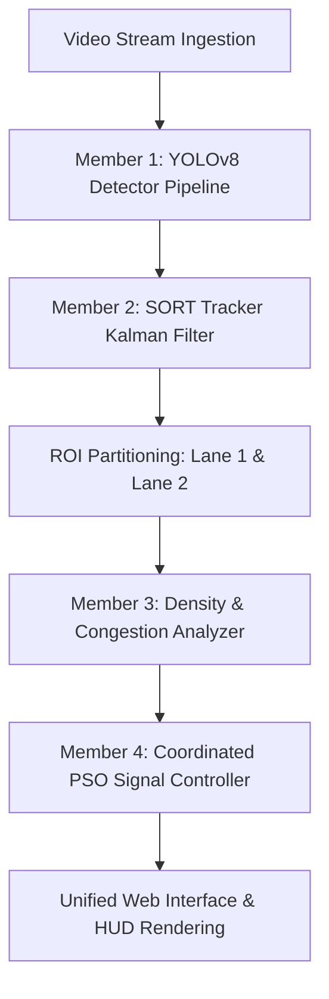

# Hybrid Swarm Intelligence & Reinforcement Learning Traffic Coordination System

An advanced, premium traffic monitoring and adaptive signal coordination prototype. The system ingests a traffic video stream, runs real-time object detection and multi-object tracking (SORT), partitions vehicles into separate lanes, and coordinates traffic light phase timings dynamically using a **Particle Swarm Optimization (PSO)** swarm-intelligence solver.

---

## 🚀 System Architecture & Integration Overview

The system integrates four distinct modules into a unified frame processing pipeline served via a **FastAPI** web application with a real-time glassmorphic dashboard interface:



---

## 👥 Team Member Roles & Contributions

### 🔹 Member 1 (You): Traffic Ingestion & Object Detection Pipeline
* **Files**: [detector.py](file:///c:/Users/VICTUS/TEST/detector.py), [config.yaml](file:///c:/Users/VICTUS/TEST/config.yaml)
* **Responsibilities**:
  * Configured declarative configuration management loading parameters for video sources, model weights, confidence thresholds, and canvas resolutions.
  * Programmed high-speed, real-time vehicle detection and class filtering using **YOLOv8** weights.
  * Classified entities into specific traffic categories (`Car`, `Truck`, `Bus`, `Motorcycle`, `Bicycle`, `Pedestrian`).
  * Implemented an overlapping/rider filter to prevent duplicate boxes when a pedestrian is riding a motorcycle.
  * Engineered a custom OpenCV Heads-Up Display (HUD) overlay at the top of the video feed, rendering neon-colored bounding boxes, class labels, confidences, current frames, and processing speed (FPS).
* **Key Packages Used**:
  * `ultralytics`: Used to instantiate and run YOLOv8 object detection models.
  * `opencv-python` (cv2): Used to capture video, resize frames, crop regions, and draw anti-aliased HUD elements.
  * `pyyaml`: Used to safely load configuration variables from YAML files.

---

### 🔹 Member 2: Multi-Object SORT Tracker
* **Files**: [tracker.py](file:///c:/Users/VICTUS/TEST/tracker.py)
* **Responsibilities**:
  * Replaced naive tracking with a robust **SORT (Simple Online and Realtime Tracking)** implementation from scratch.
  * Designed a Constant Velocity state-space **Kalman Filter** to estimate bounding box center coordinates $(u, v)$, box area $(s)$, aspect ratio $(r)$, and their respective velocities ($\dot{u}, \dot{v}, \dot{s}$).
  * Implemented data association of new detections to active tracks using an Intersection-over-Union (IoU) cost matrix matched via the Hungarian Algorithm.
  * Tracked frame-to-frame vehicle velocities to classify objects as queued (stationary) when velocity falls below `queue_speed_threshold` ($1.5$ px/frame).
* **Key Packages Used**:
  * `numpy`: Used for matrix math operations (dot products, inverses, transpose) for the Kalman Filter updates.
  * `scipy` (`scipy.optimize.linear_sum_assignment`): Used to execute the Hungarian algorithm for optimal bipartite matching of tracks to detections.

---

### 🔹 Member 3: Density Estimation & Congestion Alerts
* **Files**: [density.py](file:///c:/Users/VICTUS/TEST/density.py), [alerts.py](file:///c:/Users/VICTUS/TEST/alerts.py)
* **Responsibilities**:
  * Created a normalized traffic density estimator (`[0.0 - 1.0]`) mapping vehicle counts relative to lane saturation levels.
  * Classified lane congestion levels into `LOW`, `MED`, and `HIGH` bands dynamically.
  * Implemented event-driven safety alarms showing a flashing congestion alert warning banner at the top of the HUD and UI when a lane exceeds thresholds.
  * Developed a dual-lane logging module to write timestamps, vehicle counts, and congestion levels into a persistent CSV database.
* **Key Packages Used**:
  * `csv` & `os`: Used to check, create, and append telemetry logging records.
  * `datetime`: Used to timestamp logged congestion occurrences.

---

### 🔹 Member 4: Coordinated Signals & Benchmarking Telemetry
* **Files**: [traffic_signal.py](file:///c:/Users/VICTUS/TEST/traffic_signal.py), [compare.py](file:///c:/Users/VICTUS/TEST/compare.py)
* **Responsibilities**:
  * Engineered a coordinated dual-lane traffic light state machine transitioning sequentially through:
    $$\text{LANE1\_GREEN} \rightarrow \text{LANE1\_YELLOW} \rightarrow \text{LANE2\_GREEN} \rightarrow \text{LANE2\_YELLOW}$$
  * Designed a **Particle Swarm Optimization (PSO)** coordinator. The swarm models green light discharge rates against red light arrival accumulations to solve for the optimal phase duration $g \in [10\text{s}, 60\text{s}]$ that minimizes total wait times and queue lengths.
  * Logged performance benchmarks comparing the PSO swarm decisions against a standard fixed-time 30-second green baseline.
  * Designed overlay HUD panels rendering coordinated traffic light signals, lane statistics, and a swarm solver search convergence chart on the video feed.
* **Key Packages Used**:
  * `numpy`: Used to initialize particle coordinates, calculate velocities, boundaries, and swarm fitness.

---

## 🛠️ Combined Web Interface (`app.py`)
The unified FastAPI web application orchestrates the entire pipeline:
* **FastAPI & Uvicorn**: Serves the REST API for real-time telemetry metrics (`/api/metrics`) and streams the processed frames as an MJPEG multipart response (`/video_feed`).
* **Jinja2**: Renders the frontend interface ([index.html](file:///c:/Users/VICTUS/TEST/templates/index.html)).
* **Interactive Frontend**: Houses a side-by-side dual-lane statistic monitor, a graphic traffic signal map syncing with the FSM state, and an SVG line graph charting the real-time cost convergence of the PSO swarm.

---

## ⚙️ How to Configure & Run

### 1. Requirements
Install the dependencies:
```bash
pip install ultralytics opencv-python pyyaml numpy scipy fastapi uvicorn jinja2 pytest
```

### 2. Standalone Testing
Verify individual modules using pytest:
```bash
python -m unittest test_detector.py -v
python -m pytest test_density.py test_traffic_signal.py -v
```

### 3. Launching the Web Server
Run the FastAPI application locally:
```bash
python app.py
```
Open your browser and navigate to:
👉 **[http://127.0.0.1:8000](http://127.0.0.1:8000)**
